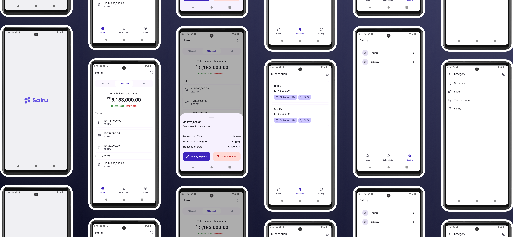

# Saku - Expense Tracker

## Introduction

Welcome to **Saku**, an advanced expense tracking application designed to help you manage your
finances with ease. Saku is built with modern technologies to ensure a seamless and efficient user
experience. Whether you're tracking income, managing expenses, or keeping tabs on your
subscriptions, Saku provides all the tools you need.

## Features

- **Income Input**: Effortlessly record and track your income sources.
- **Expense Input**: Log and categorize your expenses to maintain a clear view of your spending
  habits.
- **Subscription Reminders**: Stay on top of your recurring subscriptions with timely reminders for
  the current and upcoming months.
- **Notification System**: Receive notifications for your subscription reminders to ensure you never
  miss a payment.
- **Dynamic Theming**: Saku supports both dark and light themes, and can adapt to your device's
  system settings for a personalized experience.

## Technology Stack

Saku is developed using a comprehensive tech stack to ensure high performance and scalability:

- **Kotlin**: The main programming language for Android applications.
- **Jetpack Compose**: A modern toolkit for building native user interfaces on Android.
- **Room**: A local database to store your data securely.
- **Hilt**: For dependency injection to manage app components more easily.
- **DataStore**: For handling key-value and typed data storage more efficiently.
- **Splash Screen API**: Provides a smooth and visually appealing launch experience.
- **Flow**: For asynchronous data streams, providing a more responsive and robust application.
